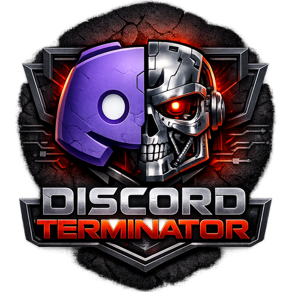

# Discord Terminator

A powerful, full-stack JavaScript tool to archive and migrate Discord channels to [Revolt](https://revolt.chat) (via Stoat) or view them locally.

## 🚀 Quick Start

### Linux / macOS
Run the launcher:
```bash
./start_LINUX_MAC.sh
```
Or for **Desktop Mode**:
```bash
./start_LINUX_MAC.sh --desktop
```

### Windows
Double-click `start_WINDOWS.bat` (Coming soon: updated bat script)

## Features
- **Archive**: Clone Discord server structure (Roles, Channels, Categories).
- **Migrate**: Move message history including attachments, embeds, and replies.
- **Node.js Backend**: Faster, more reliable migration engine using `discord.js`.
- **WebSocket Logs**: Real-time progress tracking in your browser.

## Documentation
- [Usage Guide](docs/usage.md)
- [Deployment Info](docs/DEPLOYMENT.md)
- [Docker Guide](docs/DOCKER.md)
