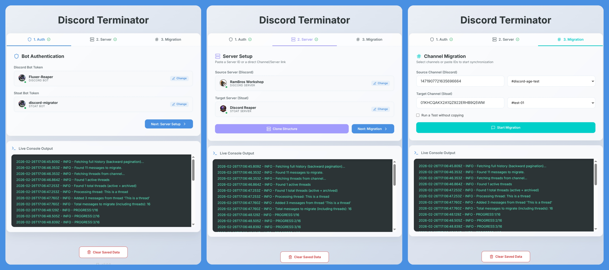

## Use the new [Reaper tool](https://github.com/rambros3d/fluxer-reaper); supports Stoat & Fluxer

### This Discord Terminator tool is no longer maintained.
You can test the public instance at https://discord-terminator.onrender.com


A full-stack JavaScript tool to archive and migrate Discord channels to [Stoat](https://stoat.chat).

## Demo
<https://raw.githubusercontent.com/rambros3d/discord-terminator/refs/heads/public/discord-terminator-demo.mp4>




---

## 🚀 Quick Start
The github repo can be directly deployed via render.com

### Linux / macOS
Run the launcher:
```bash
./start_LINUX_MAC.sh
```

## Features
- **Clone Discord Server Structure**: Roles, Channels, Categories.
- **Migrate Messages**: Move message history including attachments, embeds, and replies.
- **WebSocket Logs**: Real-time progress tracking in your browser.

---

### Vibe Code Notice
- Code is provided as is; This tool was developed with AI.
- Take it, use it, modify it, feel free to do whatever you wish.

---
